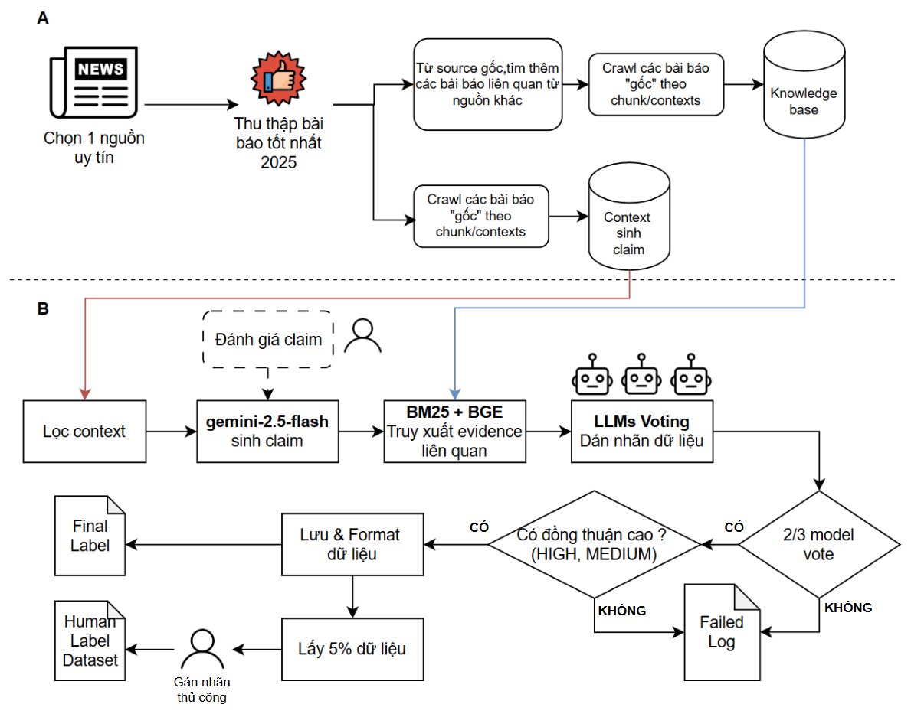
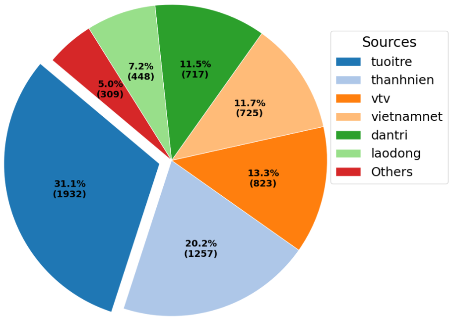
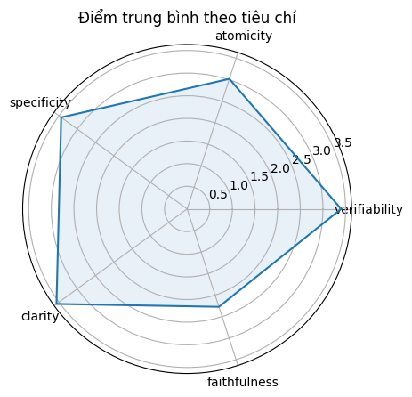
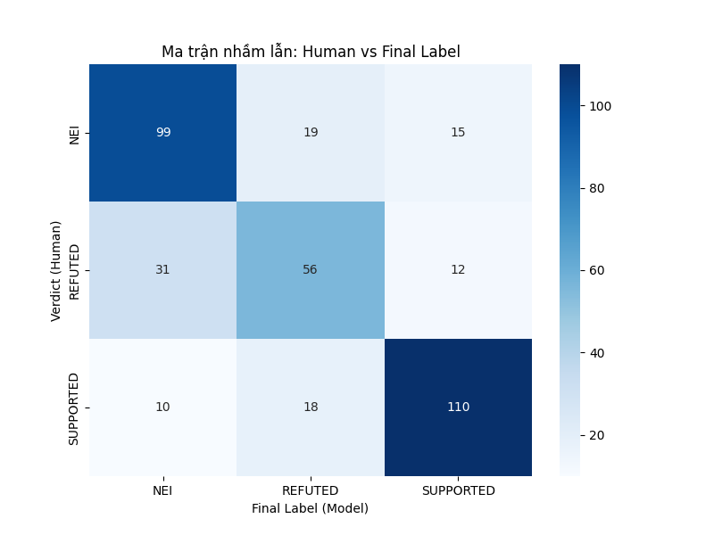
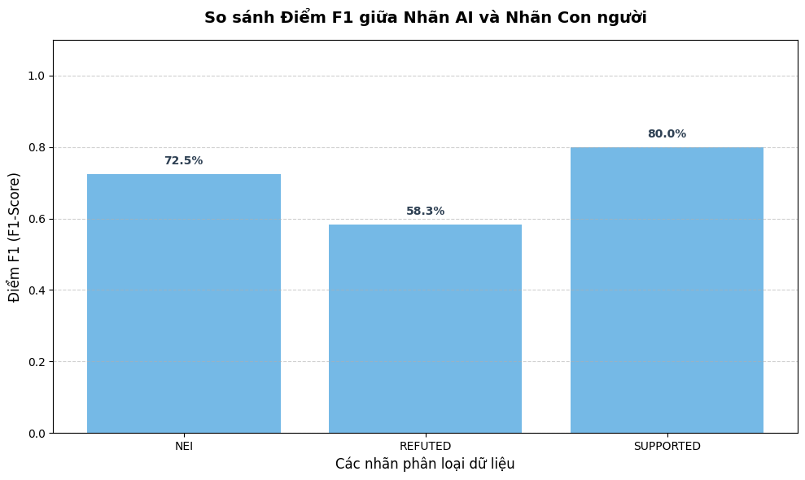
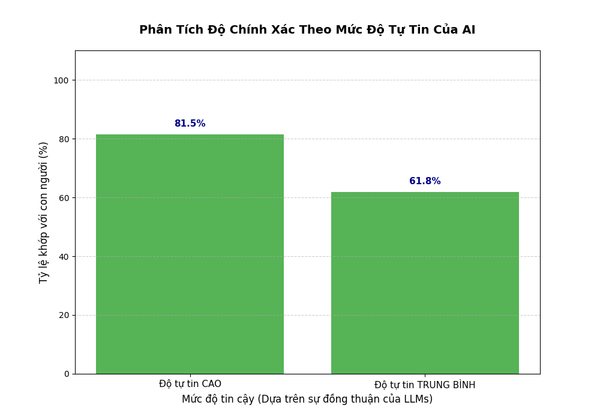

# Tổng Quan Quá Trình Xây Dựng và Khám Phá Dữ Liệu (Fact-checking Dataset)

Tài liệu này tổng hợp toàn bộ quy trình xây dựng tập dữ liệu (Dataset Construction) và các kết quả phân tích, khám phá dữ liệu (Exploratory Data Analysis - EDA) phục vụ cho bài toán kiểm chứng thông tin (Fact-checking) tiếng Việt. Chú trọng vào các lĩnh vực Chính trị và Thế giới.

---

## 1. Xây Dựng Tập Dữ Liệu (Dataset Construction)

### 1.1. Thu Thập và Tiền Xử Lý Dữ Liệu
<p align="center"></p>

- **Nguồn dữ liệu đa dạng**: Thu thập từ 17 báo điện tử uy tín. VnExpress dùng làm nguồn sinh mệnh đề (claim) và được loại khỏi Knowledge Base (KB) để tránh rò rỉ dữ liệu (data leakage). Các nguồn khác như Tuổi Trẻ, Thanh Niên, VTV... dùng để củng cố KB.
- **Tiền xử lý & Chunking**: 
  - Lọc bỏ quảng cáo, thông tin liên hệ, mô tả ảnh/video, ký tự đặc biệt, và các văn bản quá ngắn (< 50 ký tự). 
  - Chọn lọc ra 1,028 bài báo VnExpress có lượng tương tác cao nhất năm 2025.
  - Cắt văn bản nhỏ (chunking) theo kích thước ~1,000 ký tự mỗi đoạn, không cắt ngang câu.
- **Chuẩn hóa**: Toàn bộ dữ liệu lưu theo định dạng JSONL thống nhất bao gồm các trường: `id`, `source`, `url`, `text`, `title`, `date`, `topic`.

### 1.2. Thiết Kế và Sinh Mệnh Đề (Claim)
- **Sinh bằng LLM**: Sử dụng Mô hình ngôn ngữ lớn để trích xuất và diễn đạt lại những thông tin quan trọng từ văn bản nguồn, đảm bảo tính cốt lõi và có thể kiểm chứng.
- **Đánh giá chất lượng (Human-in-the-loop)**: Evaluator con người đánh giá claims theo 5 tiêu chí (Verifiability, Atomicity, Specificity, Clarity, Faithfulness) trên thang 0–4 điểm.
- Các claim được xếp loại từ "Không hợp lệ" (0-4 điểm) đến "Rất tốt" (17-20 điểm) dựa trên một bộ hướng dẫn đánh giá (Annotation Guideline) chặt chẽ.

### 1.3. Quy Trình Gán Nhãn Tự Động (Auto-labeling Pipeline)
- **Hybrid Retrieval**: Kết hợp kỹ thuật lấy thông tin BM25 (thống kê) và BGE (nhúng ngữ nghĩa) để tìm kiếm bằng chứng (Evidence) đối chiếu với Claim.
- **Multi-LLM Voting Consensus**: Sử dụng một hội đồng gồm 3 LLM (như GPT, Mistral, Qwen) để bỏ phiếu gán nhãn (`SUPPORTED`, `REFUTED`, `NEI`).
- **Mức độ đồng thuận**:
  - `HIGH_CONFIDENCE` (3/3 model đồng thuận)
  - `MEDIUM_CONFIDENCE` (2/3 model đồng thuận)
  - `LOW_CONFIDENCE` (Mâu thuẫn hoàn toàn, cần dán nhãn thủ công).
- **Kiểm định thực tế**: Dùng 5% dữ liệu chạy Blind-test để so sánh chất lượng máy sinh so với chuyên gia (Human Annotators) thông qua hệ số Cohen’s Kappa.

---

## 2. Khám Phá Dữ Liệu (Exploratory Data Analysis - EDA)


### 2.1. Thống Kê Cơ Sở Tri Thức (Knowledge Base - KB)
<p align="center">
  
  
</p>
- **Số lượng bài báo**: 1,027 bài báo (VnExpress); 2,306 bài báo mới (15 nguồn khác, nổi bật nhất: Tuổi Trẻ, Thanh Niên, VTV). Tỷ lệ chủ đề khá cân bằng (50.53% Trong nước, 49.47% Quốc tế).
- **Context phân bố**: Tổng cộng **9,105** contexts (đoạn văn). Cứ 1 context gốc từ VnExpress để sinh claim sẽ có khoảng 2 contexts từ nguồn khác hỗ trợ truy xuất evidence.
- **Nhận diện thực thể (NER)**: Chủ yếu tập trung vào Danh từ, Động từ, Các mốc thời gian và Danh từ riêng, phản ánh đúng đặc tính của dữ liệu miền Chính trị, Tin tức thế giới.

### 2.2. Phân Tích Chất Lượng Claim

- Tập dữ liệu gồm **382 claim** đánh giá thủ công có phân lượng nhãn tương đối cân bằng.
- **Chất lượng chung**: Khá cao, phần lớn đạt "Tốt" đến "Rất tốt" (13–20 điểm).
- **Phân tích tiêu chí**: `Clarity` (Độ rõ ràng: 3.56) và `Specificity` (Cụ thể: 3.44) đạt đỉnh. `Faithfulness` (Độ trung thành với gốc: 2.27) đạt thấp nhất, cho thấy LLM đôi khi tự ý thay thế số liệu hoặc thực thể.

### 2.3. Đánh Giá Toàn Bộ Dataset
<p align="center">
  
  
  
</p>
- **Hệ số đồng thuận**: LLM đạt mức Fleiss' Kappa 0.60 (Đồng thuận đáng kể - Substantial Agreement). Cặp Mistral và Qwen có độ tương đồng cao nhất.
- **Hành vi của LLM**: Khi xuất hiện nhiễu thông tin, LLM có xu hướng "thận trọng" (Conservative Bias), hay chọn nhãn `NEI` (Không có đủ thông tin) thay vì chọn nhãn `REFUTED` so với cách đánh giá gắt gao của con người.
- **Phân bố Dataset cuối cùng**: Có tổng cộng **7,198** sample dữ liệu (datapoint). 
  - Tập dữ liệu phần nào bị thiếu hụt (Imbalance) class `REFUTED`.
  - Có khoảng **402** samples rơi vào trạng thái `LOW_CONFIDENCE` (khoảng 5%). Thay vì bỏ đi, những mẫu này sẽ được dán nhãn thủ công (Human Labeling) nhằm trực tiếp bổ sung và cải thiện sự cân bằng cho nhãn `REFUTED`.


## Project Structure

```text
.
├── knowledge_base/
│   ├── KB.jsonl
│   ├── kb_embeddings.npy
│   └── Analysis.md
├── label_data/
│   ├── main/
│   │   ├── data/
│   │   │   ├── context/
│   │   │   │   └── context_claim_gen.jsonl
│   │   │   └── claim/
│   │   │       ├── claims_output.json
│   │   │       ├── claims_evaluate.json
│   │   │       └── failed_log.json
│   │   ├── dataset/
│   │   │   └── output_dataset.json
│   │   ├── source/
│   │   │   ├── configs.py
│   │   │   ├── build_cache_bge-m3.py
│   │   │   ├── claim_extract.py
│   │   │   ├── content_retrieval.py
│   │   │   └── main.py
│   │   └── final_label/
│   │       ├── EDA.ipynb
│   │       └── human_label_data.json
│   ├── pyproject.toml
│   └── uv.lock
└── link/
    ├── org/
    │   ├── org.json
    │   ├── org_raw.json
    │   ├── org_CT.json
    │   ├── org_CT.txt
    │   ├── org_TG.json
    │   └── org_TG.txt
    └── raw/
        └── combine/
```

## Directory Overview

- `knowledge_base/`  
  Contains processed data used for querying, analysis, and NLP tasks.

- `link/raw/`  
  Raw data crawled from multiple sources.

- `link/processed/`  
  Data that has been filtered, normalized, and is ready for use.

- `link/org/`  
  Raw data collected from the source [vnexpress.net](vnexpress.net).